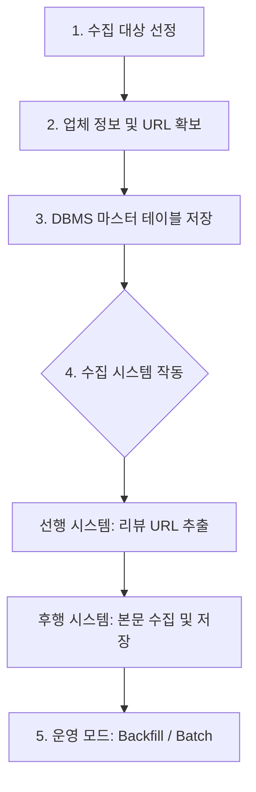
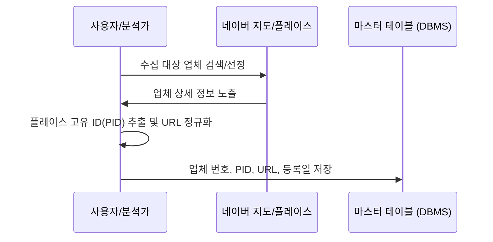
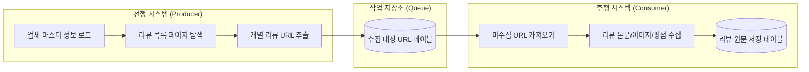
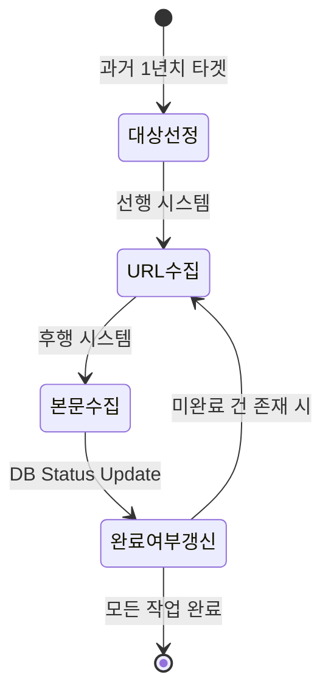
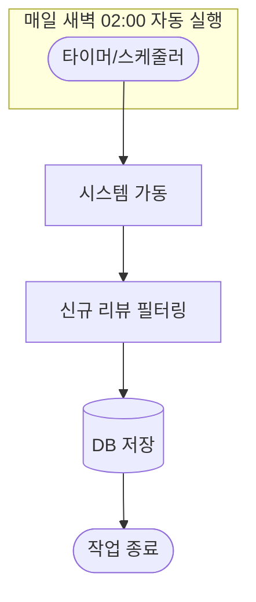

# 네이버 지도 리뷰 수집 프로세스 가이드

이 문서는 네이버 지도 리뷰를 수집하는 전체 프로세스와 데이터의 흐름을 시각화하여 파악하기 쉽게 구성한 가이드입니다. 기술적인 상세 구현보다는 작업의 절차와 논리적 구조를 중점적으로 다룹니다.

---

## 1. 전체 수집 프로세스 개요

수집 작업은 크게 **대상 선정 → 목록 확보 → 본문 수집 → 정기 운영**의 4단계로 이루어집니다.

---

## 2. Phase 01: 대상 선정 및 마스터 데이터 구축

수집의 기초가 되는 업체 정보를 체계화하여 관리하는 단계입니다.

### 데이터 흐름 상세

---

## 3. Phase 02: 이원화된 독립 수집 시스템

안정적인 수집을 위해 **목록을 찾는 작업 : 선행**과 **실제 내용을 읽는 작업 : 후행**을 분리하여 운영합니다.

### 시스템 간 데이터 흐름

---

## 4. Phase 03: 운영 모드 (Backfill & Batch)

수집 목적과 기간에 따라 두 가지 모드로 운영 시스템을 가동합니다.

### 4.1 Backfill (소급 수집)
*   **목적**: 과거 특정 기간(최근 1년 등)의 데이터를 한꺼번에 확보.
*   **특징**: 수집 완료 여부를 체크하며 모든 URL이 완료될 때까지 반복 수행.

### 4.2 Batch (정기 수집)
*   **목적**: 매일 새롭게 올라오는 리뷰를 자동으로 업데이트.
*   **방법**: 스케줄러(Crontab 등)를 통해 지정된 시간에 자동 실행.

---

## 5. 데이터 테이블 구조 (요약)

| 테이블명 | 주요 데이터 내용 | 비고 |
| :--- | :--- | :--- |
| **업체 마스터** | 업체번호, 플레이스ID, 정규화된 URL | 수집의 기준점 |
| **리뷰 작업 목록** | 업체번호 참조, 리뷰 URL, 수집상태(대기/완료) | 수집 진행 관리 |
| **리뷰 원문 데이터** | 리뷰 URL 참조, 본문, 평점, 작성일, 이미지 | 최종 수집 결과 |
